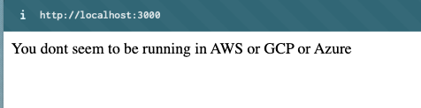
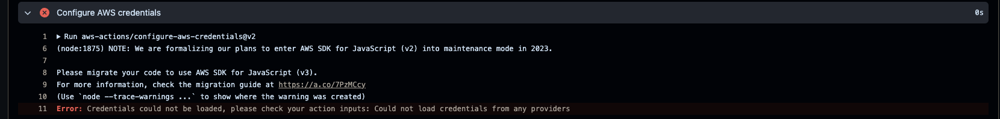
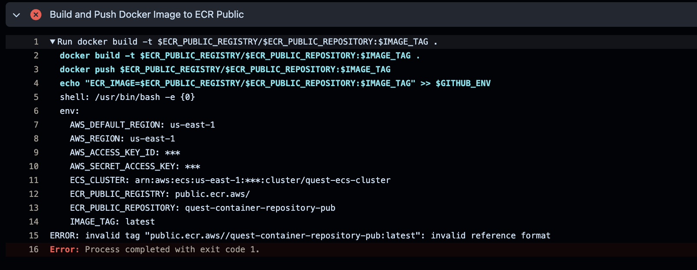

# Raw Notes

I ran into an issue when creating the Lambda function so that may not be the best approach.

---

I build a Dockerfile, but when trying to run it I get these errors:

This is the dockerfile:
```Dockerfile
# Stage 1: Base image
FROM node:22-slim AS base
ENV PNPM_HOME="/pnpm"
ENV PATH="$PNPM_HOME:$PATH"
RUN corepack enable

# Set the working directory inside the container
WORKDIR /app

# Stage 2: Install dependencies
FROM base AS deps
COPY package.json pnpm-lock.yaml ./
RUN --mount=type=cache,id=pnpm,target=/pnpm/store pnpm install --frozen-lockfile --prod

# Stage 3: Production image
FROM base AS prod
COPY --from=deps /app/node_modules ./node_modules
COPY . .
EXPOSE 3000
CMD ["pnpm", "start"]
```

This is the error:

```sh
 => ERROR [deps 2/2] RUN --mount=type=cache,id=pnpm,target=/pnpm/store pnpm install --frozen-lockfile --prod                                                 0.5s

------                                                                                                                                                            

 > [deps 2/2] RUN --mount=type=cache,id=pnpm,target=/pnpm/store pnpm install --frozen-lockfile --prod:                                                            

0.344 /usr/local/lib/node_modules/corepack/dist/lib/corepack.cjs:21535                                                                                            

0.344   if (key == null || signature == null) throw new Error(`Cannot find matching keyid: ${JSON.stringify({ signatures, keys })}`);                             

0.344                                               ^                                                                                                             

0.344                                                                                                                                                             

0.344 Error: Cannot find matching keyid: {"signatures":[{"sig":"MEYCIQDqo/55uI8Wf6M4RGn3wszRvnxozJXgQK3vMFN/1emK+AIhAOZdugJH0o6Gv0QdU3iAPB67UBlDtAp6EtXoMiVasB2t",

"keyid":"SHA256:DhQ8wR5APBvFHLF/+Tc+AYvPOdTpcIDqOhxsBHRwC7U"}],"keys":[{"expires":null,"keyid":"SHA256:jl3bwswu80PjjokCgh0o2w5c2U4LhQAE57gj9cz1kzA","keytype":"ecd

sa-sha2-nistp256","scheme":"ecdsa-sha2-nistp256","key":"MFkwEwYHKoZIzj0CAQYIKoZIzj0DAQcDQgAE1Olb3zMAFFxXKHiIkQO5cJ3Yhl5i6UPp+IhuteBJbuHcA5UogKo0EWtlWwW6KSaKoTNEYL

7JlCQiVnkhBktUgg=="}]}

0.344     at verifySignature (/usr/local/lib/node_modules/corepack/dist/lib/corepack.cjs:21535:47)

0.344     at fetchLatestStableVersion (/usr/local/lib/node_modules/corepack/dist/lib/corepack.cjs:21553:5)

0.344     at process.processTicksAndRejections (node:internal/process/task_queues:105:5)

0.344     at async fetchLatestStableVersion2 (/usr/local/lib/node_modules/corepack/dist/lib/corepack.cjs:21672:14)

0.344     at async Engine.getDefaultVersion (/usr/local/lib/node_modules/corepack/dist/lib/corepack.cjs:22298:23)

0.344     at async Engine.executePackageManagerRequest (/usr/local/lib/node_modules/corepack/dist/lib/corepack.cjs:22396:47)

0.344     at async Object.runMain (/usr/local/lib/node_modules/corepack/dist/lib/corepack.cjs:23102:5)

0.344 

0.344 Node.js v22.13.1

------

Dockerfile:13

--------------------

  11 |     FROM base AS deps

  12 |     COPY package.json pnpm-lock.yaml ./

  13 | >>> RUN --mount=type=cache,id=pnpm,target=/pnpm/store pnpm install --frozen-lockfile --prod

  14 |     

  15 |     # Stage 3: Production image

--------------------

ERROR: failed to solve: process "/bin/sh -c pnpm install --frozen-lockfile --prod" did not complete successfully: exit code: 1

Unable to find image 'quest_lambda_app:latest' locally

docker: Error response from daemon: pull access denied for quest_lambda_app, repository does not exist or may require 'docker login'.

See 'docker run --help'.
```


I asked ChatGPT with Web Search what the issue might be since I was confused about what was going on and googling didn't help much after half an hour of searching and this ended up being what ChatGPT said:

```md
The error you’re encountering during the Docker build process:

``
Error: Cannot find matching keyid: {"signatures":[{"sig":"MEYCIQDqo/55uI8Wf6M4RGn3wszRvnxozJXgQK3vMFN/1emK+AIhAOZdugJH0o6Gv0QdU3iAPB67UBlDtAp6EtXoMiVasB2t","keyid":"SHA256:DhQ8wR5APBvFHLF/+Tc+AYvPOdTpcIDqOhxsBHRwC7U"}],"keys":[{"expires":null,"keyid":"SHA256:jl3bwswu80PjjokCgh0o2w5c2U4LhQAE57gj9cz1kzA","keytype":"ecdsa-sha2-nistp256","scheme":"ecdsa-sha2-nistp256","key":"MFkwEwYHKoZIzj0CAQYIKoZIzj0DAQcDQgAE1Olb3zMAFFxXKHiIkQO5cJ3Yhl5i6UPp+IhuteBJbuHcA5UogKo0EWtlWwW6KSaKoTNEYL7JlCQiVnkhBktUgg=="}]}
``

is related to a known issue with Corepack’s signature validation when installing package managers like pnpm during Docker builds. This problem arises due to outdated or missing integrity keys in Corepack, leading to signature verification failures.

  

**Solution: Update Corepack and Install pnpm Directly**

  

To resolve this issue, you can update Corepack to the latest version and install pnpm directly in your Dockerfile. This approach ensures that you’re using the most recent integrity keys and avoids the signature validation error.

  

**Updated Dockerfile:**

```Dockerfile
# Use Node.js 22 as the base image
FROM node:22 AS base

# Set environment variables for pnpm
ENV PNPM_HOME="/pnpm"
ENV PATH="$PNPM_HOME:$PATH"

# Update Corepack to the latest version and enable it
RUN npm install -g corepack@latest && corepack enable

# Install pnpm directly
RUN corepack prepare pnpm@latest --activate

# Set the working directory inside the container
WORKDIR /app

# Copy package.json and pnpm-lock.yaml to the working directory
COPY package.json pnpm-lock.yaml ./

# Install dependencies
RUN pnpm install --frozen-lockfile --prod

# Copy the rest of the application code
COPY . .

# Expose the port your app runs on
EXPOSE 3000

# Run the app
CMD ["node", "index.js"]
```

**Explanation:**

1. **Base Image:** Starts with the official Node.js 22 image.

2. **Environment Variables:** Sets PNPM_HOME and updates PATH to include pnpm binaries.

3. **Update Corepack and Install pnpm:**

• Updates Corepack to the latest version using npm install -g corepack@latest.

• Enables Corepack with corepack enable.

• Prepares and activates the latest pnpm version with corepack prepare pnpm@latest --activate.

1. **Working Directory:** Sets /app as the working directory inside the container.

2. **Copy Dependencies Files:** Copies package.json and pnpm-lock.yaml to the container to install dependencies.

3. **Install Dependencies:** Runs pnpm install with --frozen-lockfile to ensure the lockfile is honored and --prod to install only production dependencies.

4. **Copy Application Code:** Copies the rest of your application code into the container.

5. **Expose Port:** Exposes port 3000 (adjust if your application uses a different port).

6. **Start Application:** Specifies the command to run your application.

  

**Build and Run the Docker Image:**

  

After updating your Dockerfile, build and run your Docker image with the following commands:

1. **Build the Docker Image:**

``
docker build -t quest_lambda_app .
``

  

1. **Run the Docker Container:**

``
docker run -p 3000:3000 quest_lambda_app
``


This approach ensures that you’re using the latest versions of Corepack and pnpm, preventing the signature validation error during the Docker build process.

  

For more details on this issue and potential solutions, you can refer to discussions on GitHub and Stack Overflow:

• [After Heroku restart: pnpm: Error: Cannot find matching keyid](https://stackoverflow.com/questions/79411275/after-heroku-restart-pnpm-error-cannot-find-matching-keyid)

• [Fixing Corepack Signature Validation Error with pnpm in Docker](https://rajendrasinh.com/posts/corepack-failing-for-pnpm-install/)

  

These resources provide additional context and alternative solutions that might be helpful.

I eventually resolved the issue and settled on this Dockerfile:

```Dockerfile
# Use Node.js 22 as the base image
FROM node:22 AS base

# Set environment variables for pnpm
ENV PNPM_HOME="/pnpm"
ENV PATH="$PNPM_HOME:$PATH"

# Enable Corepack and install pnpm
RUN npm install -g corepack@latest && corepack enable
RUN corepack prepare pnpm@latest --activate

# Set the working directory inside the container
WORKDIR /app

# Copy package.json and pnpm-lock.yaml to install dependencies
COPY package.json pnpm-lock.yaml ./

# Install dependencies
RUN pnpm install --frozen-lockfile --prod

# Copy application source code and rename 000.js to index.js
COPY src/000.js /app/index.js

# Copy bin directory
COPY bin/ /app/bin/

# Set execute permissions for scripts in bin
RUN chmod +x /app/bin/*

# Debugging: List files in /app after copying
RUN ls -l /app

# Expose the port your app runs on
EXPOSE 3000

# Run the app
CMD ["node", "/app/index.js"]
```

---

I built the Dockerfile a few different ways before getting something that worked:

```sh
docker: Error response from daemon: driver failed programming external connectivity on endpoint naughty_cohen (ced65839ea8298452150a7ed768b9e86ef369f0ea88b2ec8956

48bf051b0d15a): Bind for 0.0.0.0:3000 failed: port is already allocated.
```

One error I faced after building the image a few times was the one above. This was easily remediated by killing the process at that port.

I got tired of running the same commands over and over for the Docker image as well, so i wrote a bash script `setups.sh` to do that for me:

```sh
#!/bin/sh

docker build -t quest_lambda_app .

docker run -d -p 3000:3000 quest_lambda_app

docker ps --format '{{.Names}}' | grep -w "^quest_lambda_app$" 
``` 

After running the Dockerfile, I got this message to display:



I am still unsure what type of application this is, so i am going to continue with the approach of creating a lambda function with the hopes that it isn't a web server that needs to be running at all times and a 200ms delay for cold starts is acceptable.

---

Upon further thought. I am gonna skip doing the Lambda function approach, since part of the requirement is to use a Dockerfile and ECR it may be easier to just use ECS. 

---

After refactoring the application to use ECS and ECR, I am now running into issues deploying the Docker image to ECR & ECS with the github actions



I think the issue is that I need to setup OIDC authentication

---

I figured out the problem was that I misspelled a variable. So I fixed that and had a handful of other issues, but I was able to deploy to ECS successfully

---

Running into issues where ECS isn't able to pull the image from ECR, not sure why

This

```sh
aws elbv2 describe-listeners --load-balancer-arn $(aws elbv2 describe-load-balancers --names quest-alb --query 'LoadBalancers[0].LoadBalancerArn' --output text) --region us-east-1

```

 returns this:

  

```json
{

    "Listeners": [

        {

            "ListenerArn": "arn:aws:elasticloadbalancing:us-east-1:418272762224:listener/app/quest-alb/b4967228f2fd4342/dd6c670448498608",

            "LoadBalancerArn": "arn:aws:elasticloadbalancing:us-east-1:418272762224:loadbalancer/app/quest-alb/b4967228f2fd4342",

            "Port": 80,

            "Protocol": "HTTP",

            "DefaultActions": [

                {

                    "Type": "forward",

                    "TargetGroupArn": "arn:aws:elasticloadbalancing:us-east-1:418272762224:targetgroup/quest-target-group/c14e78f9009064da",

                    "Order": 1,

                    "ForwardConfig": {

                        "TargetGroups": [

                            {

                                "TargetGroupArn": "arn:aws:elasticloadbalancing:us-east-1:418272762224:targetgroup/quest-target-group/c14e78f9009064da",

                                "Weight": 1

                            }

                        ],

                        "TargetGroupStickinessConfig": {

                            "Enabled": false

                        }

                    }

                }

            ]

        }

    ]

}
```

I eventually got this error:

```json
{

    "tasks": [

        {

            "attachments": [

                {

                    "id": "cdba82b2-bada-4a19-b520-9419ad39100b",

                    "type": "ElasticNetworkInterface",

                    "status": "DELETED",

                    "details": [

                        {

                            "name": "subnetId",

                            "value": "subnet-0fe84a78b72b33891"

                        },

                        {

                            "name": "networkInterfaceId",

                            "value": "eni-00fc207eded6c268d"

                        },

                        {

                            "name": "macAddress",

                            "value": "0a:ff:d1:d2:45:81"

                        },

                        {

                            "name": "privateIPv4Address",

                            "value": "10.0.2.221"

                        }

                    ]

                }

            ],

            "attributes": [

                {

                    "name": "ecs.cpu-architecture",

                    "value": "x86_64"

                }

            ],

            "availabilityZone": "us-east-1b",

            "clusterArn": "arn:aws:ecs:us-east-1:418272762224:cluster/quest-ecs-cluster",

            "connectivity": "CONNECTED",

            "connectivityAt": "2025-02-13T21:42:08.025000-05:00",

            "containers": [

                {

                    "containerArn": "arn:aws:ecs:us-east-1:418272762224:container/quest-ecs-cluster/e7e80ebee6464e7bbeb110505cea2f81/f66f4cda-293e-4367-b442-ace0a1c9fa33",

                    "taskArn": "arn:aws:ecs:us-east-1:418272762224:task/quest-ecs-cluster/e7e80ebee6464e7bbeb110505cea2f81",

                    "name": "quest-container",

                    "image": "418272762224.dkr.ecr.us-east-1.amazonaws.com/quest-container-repository:latest",

                    "runtimeId": "e7e80ebee6464e7bbeb110505cea2f81-1566380695",

                    "lastStatus": "STOPPED",

                    "networkInterfaces": [

                        {

                            "attachmentId": "cdba82b2-bada-4a19-b520-9419ad39100b",

                            "privateIpv4Address": "10.0.2.221"

                        }
```

When I run this command it returns `null`

```sh
aws ecs describe-tasks --cluster quest-ecs-cluster --tasks e7e80ebee6464e7bbeb110505cea2f81 --query "tasks[0].networkConfiguration.awsvpcConfiguration" --region us-east-1
```

Which means one of the following:

1. The task no longer exists
2. The Task Uses the Wrong Network Mode
3. The Task is Not in a Public Subnet
4. The Security Group is Blocking Traffic

I verified that the task no longer exists by running:

```sh
aws ecs list-tasks --cluster quest-ecs-cluster --region us-east-1
```

and I got this result:

```json
{
    "taskArns": []
}
```

To fix that I could technically start a new task with the following command, but I don't think that is the solution:

```sh
aws ecs update-service --cluster quest-ecs-cluster --service quest-service --force-new-deployment --region us-east-1
```

Since when I check the network mode of the `taskDefinition` I can see that it returns `awsvpc` which is required by ECS Fargate. I verified that with this command:

```sh
aws ecs describe-task-definition --task-definition quest-task --query "taskDefinition.networkMode" --region us-east-1
```

and this was the result:

```
"awsvpc"
```

This aligns with what I have in my Terraform ECS Task Definition where I set the `network_mode` to "awsvpc" for Fargate.

I thought maybe the issue is that the task is not in a public subnet but confirmed in the Terraform that I set the network_configuration block to have `assign_public_ip` to be true and I tried to verify this with this command:

```sh
aws ecs describe-tasks --cluster quest-ecs-cluster --tasks $(aws ecs list-tasks --cluster quest-ecs-cluster --query "taskArns[0]" --output text --region us-east-1) --query "tasks[0].networkConfiguration.awsvpcConfiguration.subnets" --region us-east-1
```

But recieved this error:

```
An error occurred (InvalidParameterException) when calling the DescribeTasks operation: taskId length should be one of [32,36]
```

Before debugging that issue, I decided to check whether the security group is blocking traffic with this command:

```sh
aws ec2 describe-security-groups --group-ids sg-00e61956b155744ec --region us-east-1
```

and I got this result:

```json
{
    "SecurityGroups": [
        {
            "GroupId": "sg-00e61956b155744ec",
            "IpPermissionsEgress": [
                {
                    "IpProtocol": "-1",
                    "UserIdGroupPairs": [],
                    "IpRanges": [
                        {
                            "CidrIp": "0.0.0.0/0"
                        }
                    ],
                    "Ipv6Ranges": [],
                    "PrefixListIds": []
                }
            ],
            "VpcId": "vpc-008755acab9892e3f",
            "SecurityGroupArn": "arn:aws:ec2:us-east-1:418272762224:security-group/sg-00e61956b155744ec",
            "OwnerId": "418272762224",
            "GroupName": "quest-ecs-sg",
            "Description": "Managed by Terraform",
            "IpPermissions": [
                {
                    "IpProtocol": "tcp",
                    "FromPort": 3000,
                    "ToPort": 3000,
                    "UserIdGroupPairs": [],
                    "IpRanges": [
                        {
                            "CidrIp": "0.0.0.0/0"
                        }
                    ],
                    "Ipv6Ranges": [],
                    "PrefixListIds": []
                }
            ]
        }
    ]
}
```

Since my security group (quest-ecs-sg) allows inbound traffic on port 3000 from anywhere (0.0.0.0/0) and allows all outbound traffic, which means my ECS task should be reachable on port 3000. However, my ECS service is behind an Application Load Balancer (ALB), and the ALB is likely not forwarding traffic properly. So I need to check the Target Group health with this command and verify that the task is healthy

```sh
aws elbv2 describe-target-health --target-group-arn arn:aws:elasticloadbalancing:us-east-1:418272762224:targetgroup/quest-target-group/c14e78f9009064da --region us-east-1
```

However, when I run the above command I get this as a result:

```json
{
    "TargetHealthDescriptions": []
}
```

So I did some digging and this command:

```sh
aws ecs describe-tasks --cluster quest-ecs-cluster --tasks $(aws ecs list-tasks --cluster quest-ecs-cluster --query "taskArns[0]" --output text --region us-east-1) --query "tasks[0].networkConfiguration.awsvpcConfiguration.subnets" --region us-east-1
```

returns this error:

```
An error occurred (InvalidParameterException) when calling the DescribeTasks operation: taskId length should be one of [32,36]
```

Because there are no tasks running, I verified this with this command:

```sh
aws ecs list-tasks --cluster quest-ecs-cluster --region us-east-1
```

When I got this result:

```json
{
    "taskArns": []
}
```

What is strange about all this is when I run `nslookup` I can see the public IP of the service:

```sh
nslookup quest-alb-1340888362.us-east-1.elb.amazonaws.com
```

returns this:

```
Server:         192.168.1.1

Address:        192.168.1.1#53

  

Non-authoritative answer:

Name:   quest-alb-1340888362.us-east-1.elb.amazonaws.com

Address: 34.198.195.65
```

I think the issue might be the vpc subnets, so I am switching the CIDR to use:

`10.0.0.0/20` instead of `10.0.1.0/24` for subnet 1 and `10.0.16.0/20` instead of `10.0.2.0/24` for subnet 2

If that isn't the fix, I will try to setup the github action to run the Terraform apply instead of running it locally since I setup a different IAM user for my local machine than the github action, the issue might be related to that.

So after running `terraform apply` after changing the subnets, I got this error:

```sh
│ Error: deleting EC2 Subnet (subnet-0fe84a78b72b33891): operation error EC2: DeleteSubnet, https response error StatusCode: 400, RequestID: 6ee1a926-8618-4952-9058-9
529519ce2f3, api error DependencyViolation: The subnet 'subnet-0fe84a78b72b33891' has dependencies and cannot be deleted.
│ 
│ 
╵
╷
│ Error: creating EC2 Subnet: operation error EC2: CreateSubnet, https response error StatusCode: 400, RequestID: 8a3d6b10-4a5b-48c8-8064-8a3d02c938cd, api error Inva
lidSubnet.Conflict: The CIDR '10.0.0.0/20' conflicts with another subnet
│ 
│   with aws_subnet.quest_subnet_1,
│   on main.tf line 225, in resource "aws_subnet" "quest_subnet_1":
│  225: resource "aws_subnet" "quest_subnet_1" {
│ 
```

I figure it's a good idea to find out what the dependencies are, so i ran this command:

```sh
aws ec2 describe-network-interfaces --filters "Name=subnet-id,Values=subnet-0fe84a78b72b33891" --region us-east-1
```

and got this result:

```json
{
    "NetworkInterfaces": [
        {
            "Association": {
                "IpOwnerId": "amazon-elb",
                "PublicDnsName": "",
                "PublicIp": "34.198.195.65"
            },
            "Attachment": {
                "AttachTime": "2025-02-13T21:08:39+00:00",
                "AttachmentId": "eni-attach-0cf883622f96013a1",
                "DeleteOnTermination": false,
                "DeviceIndex": 1,
                "NetworkCardIndex": 0,
                "InstanceOwnerId": "amazon-elb",
                "Status": "attached"
            },
            "AvailabilityZone": "us-east-1b",
            "Description": "ELB app/quest-alb/b4967228f2fd4342",
            "Groups": [
                {
                    "GroupId": "sg-022820fd4ae1ca86d",
                    "GroupName": "quest-alb-sg"
                }
            ],
            "InterfaceType": "interface",
            "Ipv6Addresses": [],
            "MacAddress": "0a:ff:e7:7c:23:71",
            "NetworkInterfaceId": "eni-0b55f98929a277251",
            "OwnerId": "418272762224",
            "PrivateIpAddress": "10.0.2.91",
            "PrivateIpAddresses": [
                {
                    "Association": {
                        "IpOwnerId": "amazon-elb",
                        "PublicDnsName": "",
                        "PublicIp": "34.198.195.65"
                    },
                    "Primary": true,
                    "PrivateIpAddress": "10.0.2.91"
                }
            ],
            "RequesterId": "amazon-elb",
            "RequesterManaged": true,
            "SourceDestCheck": true,
            "Status": "in-use",
            "SubnetId": "subnet-0fe84a78b72b33891",
            "TagSet": [],
            "VpcId": "vpc-008755acab9892e3f",
            "Operator": {
                "Managed": false
            }
	    }
    ]
}
```

When i check for existing subnets in the VPC with this command:

```sh
aws ec2 describe-subnets --filters "Name=vpc-id,Values=vpc-008755acab9892e3f" --region us-east-1 --query "Subnets[*].{Subnet:SubnetId,CIDR:CidrBlock}"
```

I get this result:

```json
[
    {
        "Subnet": "subnet-0fe84a78b72b33891",
        "CIDR": "10.0.2.0/24"
    }
]
```

I think the issue is that the subnet the subnet *subnet-0fe84a78b72b33891* is still associated with an Elastic Load Balancer. This is why I am encountering the `DependencyViolation` error when trying to delete the subnet.

I am going to try to deregister the load balancer with this command:

```sh
aws elbv2 deregister-targets --target-group-arn arn:aws:elasticloadbalancing:us-east-1:418272762224:targetgroup/quest-target-group/c14e78f9009064da --targets Id=10.0.2.91
```

then delete the ALB with this command:

```sh
aws elbv2 delete-load-balancer --load-balancer-arn arn:aws:elasticloadbalancing:us-east-1:418272762224:loadbalancer/app/quest-alb/b4967228f2fd4342
```

Then confirm it is deleted with this command:

```sh
aws elbv2 describe-load-balancers --region us-east-1
```

Then after I do the above steps, I can delete the subnet manually with this command:

```sh
aws ec2 delete-subnet --subnet-id subnet-0fe84a78b72b33891 --region us-east-1
```

Before re-running `terraform apply`.

---

So I re-ran `terraform apply` and everything seemed to have worked after deleting the subnet

---

I refactored the CI/CD Pipelines so that the Build & Deploy step only happens after terraform runs lint, format, and security checks but ran into an issue with the `terraform apply` stage since the resources already existed. So I had to modify my terraform configurations as follows:

1. Use lifecycle to prevent accidental destruction:
	- This ensures Terraform doesn’t attempt to recreate existing resources.

2. Use data sources to check if the resource exists:
	- If the resource already exists, Terraform won’t try to create it again.

---

I am facing this issue again:

```
ResourceInitializationError: unable to pull secrets or registry auth: The task cannot pull registry auth from Amazon ECR: There is a connection issue between the task and Amazon ECR. Check your task network configuration. RequestError: send request failed caused by: Post "https://api.ecr.us-east-1.amazonaws.com/": dial tcp 44.213.79.50:443: i/o timeout
```

Seems the issue was that the ECR registry was private. Due to time constraints and not being able to figure out what I am missing to get ECS to be able to pull the image from the private registry, I am just changing the registry from a private registry to a public registry.

---

I added a check to the CI pipeline to not run terraform unless there are code changes to the terraform config. This way, it doesn't create the resources on every push.

---

I keep getting this error:



The error **“invalid reference format”** in your Docker tag suggests that **ECR_PUBLIC_REGISTRY is not correctly formatted**. Based on the error log, the ECR_PUBLIC_REGISTRY variable is set as:

```
ECR_PUBLIC_REGISTRY: public.ecr.aws/
```

The problem is the **trailing slash (/)** in public.ecr.aws/. It should be **public.ecr.aws** (without the slash).

**Fix**

Update the environment variable assignment in my GitHub Actions workflow:

```yaml
      - name: Set ECR Public Registry
        run: echo "ECR_PUBLIC_REGISTRY=public.ecr.aws" >> $GITHUB_ENV
```

And update my docker build command to use the correct format:

```yaml
      - name: Build and Push Docker Image to ECR Public
        env:
          ECR_PUBLIC_REGISTRY: public.ecr.aws
          ECR_PUBLIC_REPOSITORY: quest-container-repository-pub
          IMAGE_TAG: latest
        run: |
          docker build -t $ECR_PUBLIC_REGISTRY/$ECR_PUBLIC_REPOSITORY:$IMAGE_TAG .
          docker push $ECR_PUBLIC_REGISTRY/$ECR_PUBLIC_REPOSITORY:$IMAGE_TAG
          echo "ECR_IMAGE=$ECR_PUBLIC_REGISTRY/$ECR_PUBLIC_REPOSITORY:$IMAGE_TAG" >> $GITHUB_ENV
```

**Explanation**

1. **Issue:** The trailing slash (/) in ECR_PUBLIC_REGISTRY=public.ecr.aws/ results in an invalid Docker tag format (public.ecr.aws//quest-container-repository-pub:latest).

2. **Fix:** Remove the trailing slash so that the registry URL is correctly formatted (public.ecr.aws/quest-container-repository-pub:latest).

**Correct Format**

```sh
docker build -t public.ecr.aws/quest-container-repository-pub:latest .
docker push public.ecr.aws/quest-container-repository-pub:latest
```

After making this change, I need to rerun the GitHub Actions workflow, and it should successfully push your Docker image to Amazon ECR Public.

---

I still can't figure out what I am doing wrong here:

This is what I found to solve the problem:

```
The error "ResourceInitializationError: unable to pull secrets or registry auth: The task cannot pull registry auth from Amazon ECR: There is a connection issue between the task and Amazon ECR" indicates that your Amazon ECS task is unable to connect to Amazon ECR to pull registry authentication, which is often due to network misconfiguration[1][5][8][9]. This can occur in both EC2 and Fargate launch types[6].
```

Here are potential causes and how to address the issue:


*   **Network Configuration Issues:** The task needs a network path to communicate with ECR and AWS Secrets Manager[^10].
    *   Verify the task's network configuration[^1][^5].
    *   Confirm that the subnet for your worker node has a route to the internet by checking the route table[^2].
    *   If you're using a private subnet, ensure you have a NAT Gateway or VPC endpoint set up to access ECR[^11].

*   **Security Group Configuration:** The security group associated with your worker node must allow outbound internet traffic[^2].
    *   Ensure the security group's outbound rules allow all traffic, or specifically allow access to the necessary ports and protocols for ECR[^11].
    *   Incorrect security group settings can prevent the task from accessing the public ECR domain[^9].

*   **IAM Permissions:** The task execution role might lack the necessary permissions to pull images from ECR[^3][^6].
    *   Confirm that your `ecsTaskExecutionRole` has the `AmazonECSTaskExecutionRolePolicy` attached[^6].
    *   The trust relationship for the role should allow `ecs-tasks.amazonaws.com` to assume it[^6].
    *   If performing cross-account image pulling, the ECR repository must have permissions that specifically allow the ARN of your `ecsTaskExecutionRole`[^6].
    *   Ensure you have configured the correct policy for your user, such as `AmazonEC2ContainerRegistryFullAccess`[^3].

*   **VPC Endpoints:** If you're using a private repository, you might need to create interface VPC endpoints for Amazon ECR[^2][^12].

*   **Repository Existence and Region:** Verify that the repository exists in the AWS ECR Console in the correct region[^3].

*   **Multi-Factor Authentication (MFA):** If you're using MFA, you might need to create a session token[^3].

*   **Connectivity Issues:** There might be a general connection issue between the task and Amazon ECR[^1]. You can verify the connectivity between the task and the endpoint[^1].

*   **Network ACLs:** The ingress and egress rules for your network access control lists (ACLs) must allow access to the internet[^2].

By checking these areas, you should be able to identify and resolve the `ResourceInitializationError` preventing your ECS task from pulling images from ECR[^1][^2][^3][^5][^6][^9][^10][^11][^12].

[^1]: https://docs.aws.amazon.com/AmazonECS/latest/developerguide/resource-initialization-error.html
[^2]: https://repost.aws/knowledge-center/eks-ecr-troubleshooting
[^3]: https://stackoverflow.com/questions/70452836/docker-push-to-aws-ecr-hangs-immediately-and-times-out
[^4]: https://repost.aws/knowledge-center/ecs-unable-to-pull-secrets
[^5]: https://docs.aws.amazon.com/AmazonECS/latest/developerguide/stopped-tasks-error-messages-updates.html
[^6]: https://repost.aws/questions/QUm1P98sRwQhquKPMbjpgA3A/not-able-to-access-private-ecr-repo-and-image
[^7]: https://docs.aws.amazon.com/AmazonECR/latest/public/security_iam_troubleshoot.html
[^8]: https://repost.aws/questions/QUgPLxbt2vQAmaKtwxPmlVeg/fargate-deployment-can-not-pull-from-ecr
[^9]: https://www.reddit.com/r/aws/comments/1gnrmc6/fargate_cant_connect_to_ecr_despite_being_in_a/
[^10]: https://stackoverflow.com/questions/61265108/aws-ecs-fargate-resourceinitializationerror-unable-to-pull-secrets-or-registry
[^11]: https://repost.aws/questions/QUTTXzLlU_T72po4QROT1c2w/resourceinitializationerror-unable-to-pull-secrets-or-registry-auth-execution-resource-retrieval-failed-unable-to-retrieve-ecr-registry-auth-service-call-has-been-retried-3-time-s-requesterror
[^12]: https://stackoverflow.com/questions/71659113/ecs-fargate-task-in-eventbridge-fails-with-resourceinitializationerror/71707414

---

 So I asked for help in the AltF4 Discord server and someone said that when building an ECS service you gotta assign 2 iam roles.

1. **Task Execution Role:**  this is typically what the service as a whole will need things like access to a log group or certain network services or pulling the image from ECR.
2. **Task Role:** this is needed if the container will use other service within like S3 to retrieve/store data

I believe the task execution role is the role that is actually required to start the task
Where as the task role itself is what the process inside needs for access to things

---
## Notes on SSL Setup

I need to setup SSL, but Route53 doesn't offer a free tier, so I have to go the Self Signed Certificate route. However, since the ALB DNS name is dynamic I need to setup a wildcard certificate.

To generate a self-signed wildcard certificate for an AWS ALB DNS name, I need to follow these steps:

### 1. Retrieve Your ALB DNS Name

First, I need to obtain my ALB’s DNS name. I can do this using Terraform or AWS CLI:

#### **Terraform**

```sh
terraform output alb_dns_name
```

#### **AWS CLI**
```sh
aws elbv2 describe-load-balancers --query "LoadBalancers[*].DNSName"
```

#### **Example ALB DNS Name:**

```
my-alb-1234567890.us-east-1.elb.amazonaws.com
```

## 2. Generate a Self-Signed Wildcard Certificate

A wildcard certificate covers all subdomains of a given domain (e.g., *.us-east-1.elb.amazonaws.com).

### Step 1: Create a Private Key

```sh
openssl genrsa -out wildcard_private_key.pem 2048
```

### Step 2: Create a Certificate Signing Request (CSR)

Replace `<my-alb-region>.elb.amazonaws.com with my ALB’s top-level domain:

```sh
openssl req -new -key wildcard_private_key.pem -out wildcard_csr.pem -subj "/CN=*.us-east-1.elb.amazonaws.com"
```

### Step 3: Generate a Self-Signed Wildcard Certificate

```sh
openssl x509 -req -days 365 -in wildcard_csr.pem -signkey wildcard_private_key.pem -out wildcard_certificate.pem
```

This creates:
- wildcard_private_key.pem → Private key
- wildcard_certificate.pem → Self-signed wildcard certificate (valid for 1 year)

## 3. Upload the Certificate to AWS IAM

AWS Certificate Manager (ACM) does not support self-signed certificates, so I need to upload it to AWS IAM.

```sh
aws iam upload-server-certificate \
  --server-certificate-name wildcard-selfsigned-cert \
  --certificate-body file://wildcard_certificate.pem \
  --private-key file://wildcard_private_key.pem
```

Verify the uploaded certificate:

```sh
aws iam list-server-certificates
```

## 4. Use the Wildcard Certificate in Terraform

Modify my Terraform configuration to use the IAM wildcard certificate:

```hcl
resource "aws_iam_server_certificate" "alb_wildcard_cert" {
  name             = "wildcard-selfsigned-cert"
  certificate_body = file("wildcard_certificate.pem")
  private_key      = file("wildcard_private_key.pem")
}

resource "aws_lb_listener" "https_listener" {
  load_balancer_arn = aws_lb.quest_alb.arn
  port              = 443
  protocol          = "HTTPS"
  ssl_policy        = "ELBSecurityPolicy-2016-08"
  certificate_arn   = aws_iam_server_certificate.alb_wildcard_cert.arn

  default_action {
    type             = "forward"
    target_group_arn = aws_lb_target_group.quest_tg.arn
  }
}
```

## 5. Apply Terraform Changes

Run:

```sh
terraform apply
```

This will configure TLS on the ALB using a wildcard self-signed certificate.

## Important Notes
- Wildcard certificates only work for subdomains, e.g., subdomain.us-east-1.elb.amazonaws.com, but not for the root ALB domain itself.
- Browsers will show security warnings since the certificate is self-signed.
- For production, use AWS ACM with a trusted CA-issued certificate.

---
---

### Q: What is the CSR for if we're not uploading this to AWS?

The Certificate Signing Request (CSR) is used when requesting a certificate from a Certificate Authority (CA) (e.g., Let’s Encrypt, AWS ACM, DigiCert). However, when generating a self-signed certificate, we don’t need an external CA, so the CSR is only an intermediate step.

### Q: Why Generate a CSR If We're Not Using It in Terraform?

The CSR is primarily used to create a certificate that conforms to standard practices, even if we’re signing it ourselves. Here’s why it’s still useful:
1. **Ensures Proper Subject Information**
- The CSR contains details like the Common Name (CN) (e.g., *.example.com), organization, country, etc.
- When we generate a certificate directly, we might miss this structured format.
2. **Follows Standard Certificate Generation Workflow**
- If we later decide to use a trusted CA, we can reuse the CSR to request a signed certificate from AWS ACM or a commercial provider.
3. **Allows for Certificate Extensions**
- Some organizations use CSR extensions for security purposes, which ensures proper configuration when generating self-signed certificates.

### Q: When Do We Actually Use the CSR?
- If you need a trusted certificate, you would submit the CSR to a Certificate Authority (CA) like:
- AWS Certificate Manager (ACM)
- Let’s Encrypt
- DigiCert, GoDaddy, etc.
- For self-signed certificates, we just use the CSR to generate the final certificate.pem, but we don’t need the CSR anymore after that.

### Q: What If We Skip the CSR?
We can generate the self-signed certificate without the CSR by combining it into a single command:

```sh
openssl req -x509 -nodes -newkey rsa:2048 -keyout wildcard_private_key.pem -out wildcard_certificate.pem -days 365 -subj "/CN=*.yourdomain.com"
```

This avoids the extra CSR step entirely.

### Conclusion
- The CSR is an optional step for self-signed certificates.
- It follows best practices and can be used later if a trusted CA is needed.
- Terraform doesn’t use it because IAM only needs the final certificate and private key.

---

# Challenges with setting up SSL

## Problem
After running `terraform apply` with the latest changes, I get this error:


```sh
│ Error: creating ELBv2 Listener (arn:aws:elasticloadbalancing:us-east-1:418272762224:loadbalancer/app/quest-alb/bc57bf3bef32c152): operation error Elastic Load Balancing v2: CreateListener, https response error StatusCode: 400, RequestID: 1e3ab651-b76a-4273-b9d7-6d716da53384, DuplicateListener: A listener already exists on this port for this load balancer 'arn:aws:elasticloadbalancing:us-east-1:418272762224:loadbalancer/app/quest-alb/bc57bf3bef32c152'
│ 
│   with aws_lb_listener.http_redirect,
│   on main.tf line 180, in resource "aws_lb_listener" "http_redirect":
│  180: resource "aws_lb_listener" "http_redirect" {
│ 
```

The error message “DuplicateListener: A listener already exists on this port for this load balancer” occurs because an ALB can only have one listener per port.

In my Terraform code, I likely already have an HTTP (port 80) listener, and when adding the new `http_redirect` resource, Terraform tries to create another listener on port 80, causing the conflict.

## How to Fix This

### 1. Check for an Existing Listener on Port 80

Look for an existing listener in my Terraform configuration:

```hcl
resource "aws_lb_listener" "http_listener" {
  load_balancer_arn = aws_lb.quest_alb.arn
  port              = 80
  protocol          = "HTTP"

  default_action {
    type             = "forward"
    target_group_arn = aws_lb_target_group.quest_tg.arn
  }
}
```

If this already exists, it conflicts with the new redirect listener.

### 2. Modify the Existing HTTP Listener to Redirect to HTTPS

Instead of creating a new listener (http_redirect), modify the existing http_listener to redirect traffic to HTTPS:

```hcl
resource "aws_lb_listener" "http_listener" {
  load_balancer_arn = aws_lb.quest_alb.arn
  port              = 80
  protocol          = "HTTP"

  default_action {
    type = "redirect"

    redirect {
      port        = "443"
      protocol    = "HTTPS"
      status_code = "HTTP_301"
    }
  }
}
```

This will ensure:
- There is only one listener on port 80.
- All HTTP requests automatically redirect to HTTPS.
- Terraform will apply changes successfully.

### 3. Apply Changes

Once I have modified the existing listener, I need to apply the Terraform changes:

```sh
terraform apply
```

If Terraform still detects the old conflicting listener, I can delete it manually. To do that I need to get the loadbalancer-arn so that I can get the listener arn

```sh
aws elbv2 describe-load-balancers --query "LoadBalancers[*].[LoadBalancerArn, DNSName]" --output table
```

This will display a table like this containing the loadbalancer arn and the dns name:

```
---------------------------------------------------------------------------------------------------------------------------------------------------------
|                                                                 DescribeLoadBalancers                                                                 |
+--------------------------------------------------------------------------------------------------+----------------------------------------------------+
|  arn:aws:elasticloadbalancing:us-east-1:418272762224:loadbalancer/app/quest-alb/bc57bf3bef32c152 |  quest-alb-1868208414.us-east-1.elb.amazonaws.com  |
+--------------------------------------------------------------------------------------------------+----------------------------------------------------+
```

Then I can use the loadbalancer arn to get the listeners like this:

```sh
aws elbv2 describe-listeners --load-balancer-arn arn:aws:elasticloadbalancing:us-east-1:418272762224:loadbalancer/app/quest-alb/bc57bf3bef32c152 --query "Listeners[*].ListenerArn" --output text
```

Since I have two listeners, it should display something like this:

```
arn:aws:elasticloadbalancing:us-east-1:418272762224:listener/app/quest-alb/bc57bf3bef32c152/2820285e43d064a5    arn:aws:elasticloadbalancing:us-east-1:418272762224:listener/app/quest-alb/bc57bf3bef32c152/9148730111aceec3
```

Then I can use the listener-arn(s) to delete the listener like this:

```sh
aws elbv2 delete-listener --listener-arn arn:aws:elasticloadbalancing:us-east-1:418272762224:listener/app/quest-alb/bc57bf3bef32c152/2820285e43d064a5 && \
aws elbv2 delete-listener --listener-arn arn:aws:elasticloadbalancing:us-east-1:418272762224:listener/app/quest-alb/bc57bf3bef32c152/9148730111aceec3
```

Then re-run:

```sh
terraform apply
```

---
---

After doing the above steps, I am now getting this error again:

```
╷
│ Error: creating ELBv2 Listener (arn:aws:elasticloadbalancing:us-east-1:418272762224:loadbalancer/app/quest-alb/bc57bf3bef32c152): operation error Elastic Load Balancing v2: CreateListener, https response error StatusCode: 400, RequestID: fabae3e1-8711-4c59-baf8-5a88229067ed, DuplicateListener: A listener already exists on this port for this load balancer 'arn:aws:elasticloadbalancing:us-east-1:418272762224:loadbalancer/app/quest-alb/bc57bf3bef32c152'
│ 
│   with aws_lb_listener.http_redirect,
│   on main.tf line 180, in resource "aws_lb_listener" "http_redirect":
│  180: resource "aws_lb_listener" "http_redirect" {
```

The error “DuplicateListener: A listener already exists on this port for this load balancer” means that a listener on the same port already exists for your AWS ALB. This usually happens when trying to create multiple listeners on the same port 80 (HTTP) or 443 (HTTPS).

## How to Fix This

Follow these steps to identify and remove the duplicate listener:

### 1. Check Existing Listeners for the Load Balancer

Run the following command to list all existing listeners:
```sh
aws elbv2 describe-listeners --load-balancer-arn arn:aws:elasticloadbalancing:us-east-1:418272762224:loadbalancer/app/quest-alb/bc57bf3bef32c152 --query "Listeners[*].[ListenerArn,Port,Protocol]" --output table
```

This will output something like:

```
---------------------------------------------------------------
|                        DescribeListeners                    |
+-------------------------------------------------------------+
| arn:aws:elasticloadbalancing:us-east-1:418272762224:listener/app/quest-alb/bc57bf3bef32c152/abc123 | 80  | HTTP  |
| arn:aws:elasticloadbalancing:us-east-1:418272762224:listener/app/quest-alb/bc57bf3bef32c152/xyz789 | 443 | HTTPS |
+-------------------------------------------------------------+
```

If there’s already a port 80 listener, that’s likely the conflict.

### 2. Delete the Conflicting Listener

Now that I have the Listener ARN for the conflicting port, delete it:
```sh
aws elbv2 delete-listener --listener-arn arn:aws:elasticloadbalancing:us-east-1:418272762224:listener/app/quest-alb/bc57bf3bef32c152/abc123
```
	🚨 Be careful! Ensure you’re deleting the correct listener (port 80 or 443).

### 3. Modify Terraform to Avoid Duplication

Instead of creating a new HTTP listener, modify the existing HTTP listener to redirect traffic to HTTPS (if that’s what Ixxxxxxxxxxxxxxxxxxxxxxxxxdddddddbfbhgjjf    want).

Check Terraform Code for Duplicates

#### Look for two resources with:
- resource "aws_lb_listener" "http_listener" (Port 80)
- resource "aws_lb_listener" "http_redirect" (Port 80, Redirect to HTTPS)

If both exist, remove the http_redirect listener and modify the existing http_listener:

```hcl
resource "aws_lb_listener" "http_listener" {
  load_balancer_arn = aws_lb.quest_alb.arn
  port              = 80
  protocol          = "HTTP"

  default_action {
    type = "redirect"

    redirect {
      port        = "443"
      protocol    = "HTTPS"
      status_code = "HTTP_301"
    }
  }
}
```

Why? ALB only allows one listener per port—instead of creating a new redirect listener, we update the existing HTTP listener to perform the redirect.

### 4. Apply Terraform Again

Now, apply the changes:

```sh
terraform apply
```

---
---

I found the issue, and it seems that I hav a duplicate HTTP Listener on Port 80


I have two listeners configured for port 80 (HTTP):
1. aws_lb_listener.http_listener (forwards traffic to target group)
2. aws_lb_listener.http_redirect (redirects HTTP to HTTPS)

Since an ALB can only have one listener per port, Terraform throws the error.

## *Fix:* Remove the Duplicate HTTP Listener

I should remove the `http_listener` and keep `http_redirect` to ensure that HTTP traffic is redirected to HTTPS.


```hcl
# Redirect HTTP to HTTPS
resource "aws_lb_listener" "http_redirect" {
  load_balancer_arn = aws_lb.quest_alb.arn
  port              = 80
  protocol          = "HTTP"

  default_action {
    type = "redirect"

    redirect {
      port        = "443"
      protocol    = "HTTPS"
      status_code = "HTTP_301"
    }
  }
}

# HTTPS Listener (Handles Traffic)
resource "aws_lb_listener" "https_listener" {
  load_balancer_arn = aws_lb.quest_alb.arn
  port              = 443
  protocol          = "HTTPS"
  ssl_policy        = "ELBSecurityPolicy-2016-08"
  certificate_arn   = aws_iam_server_certificate.quest_ssl_cert.arn

  default_action {
    type             = "forward"
    target_group_arn = aws_lb_target_group.quest_tg.arn
  }
}
```

## Final Thoughts on Setting up SSL
- You cannot have multiple listeners on the same port.
- Instead of creating a new redirect listener, modify the existing HTTP listener to handle HTTP → HTTPS redirects.
- If the issue persists, manually check the existing ALB listeners in AWS Console or CLI.
- Use aws elbv2 describe-listeners to find duplicate listeners.
- Use aws elbv2 delete-listener to remove the conflicting one.
- Modify the existing Terraform http_listener to redirect instead of creating a new one.
- Run terraform apply to apply the fix.
